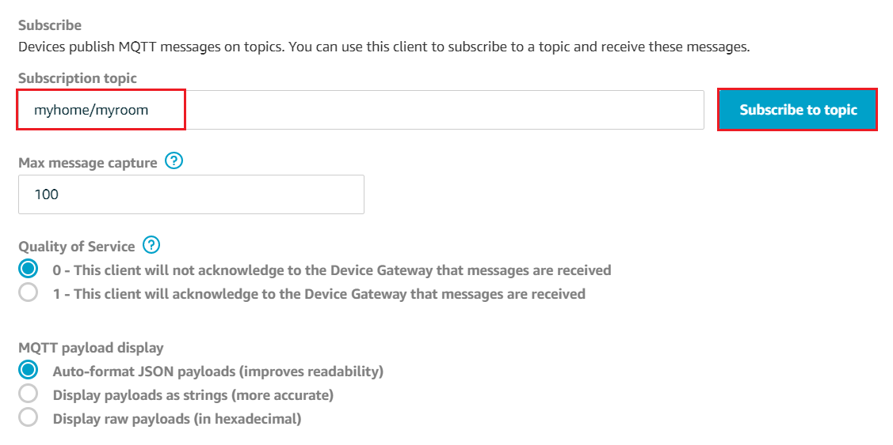

# Azure Sphere Zero touch provisioning on AWS IoT Core

This demo use Azure Sphere's Root-of-Trust identity to register on AWS IoT Core platform through Just-in-time-registeration, aka [JITR](https://aws.amazon.com/blogs/iot/just-in-time-registration-of-device-certificates-on-aws-iot/) mechanism and publish a message to a user defined topic. User can have a zero-touch provisioning expereience with high security and trustworthy using Azure Sphere. 

## User Guide

### Prerequisite

1. Azure Sphere RDB from SeeedStudio
2. [Azure Sphere SDK](https://aka.ms/AzureSphereSDKDownload) and [Visual Studio 2019](https://visualstudio.microsoft.com/) 16.04 or later are installed on your Windows 10 PC.
3. [Microsoft Account](https://docs.microsoft.com/en-us/azure-sphere/deployment/microsoft-account) to be used with Azure Sphere Developer Utility
4. [AWS Account](https://aws.amazon.com/) to host your services
5. [AWS CLI](https://aws.amazon.com/cli/) and [boto3](https://boto3.amazonaws.com/v1/documentation/api/latest/guide/quickstart.html#installation) are installed on your PC. 

### Setup for Azure Sphere 

1. Follow the guide of [Get started with a development kit](https://docs.microsoft.com/en-us/azure-sphere/install/overview) to setup your Azure Sphere RDB and claim it your tenant. 
2. [Setup WiFi for Azure Sphere](https://docs.microsoft.com/en-us/azure-sphere/install/configure-wifi#set-up-wi-fi-on-your-azure-sphere-device) and ensure it get connected to internet. 
3. Put your device into development mode by
   
   ```
   azsphere device enable-development
   ```
4. Retrieve your Azure Sphere tenant ID and record for later use
   
   ```
   azsphere tenant show-selected
   ```

### Setup for AWS environment

1. Login AWS and go to IAM service to [add a Programmatic access user](https://docs.aws.amazon.com/IAM/latest/UserGuide/id_users_create.html#id_users_create_console). Assign **AdministratorAccess** permission to this new user and record access id id and key
   
   

   

   

2. Open Windows command prompt, use AWS CLI to configure your credentials file by 

   ```
   aws configure
   ``` 

   You will be asked to provide access id and access key created in the previous step, and you also provide the default region code, refer to this [page](https://docs.aws.amazon.com/general/latest/gr/rande.html) to get the full list of supported region. E.g. `ap-northeast-1` is for Asia Pacific (Tokyo). 
   
   > Please note all resources in this demo will be depolyed to this default region.

3. All resources required on AWS will be created by the preconfigure.py script using boto3 SDK. Go to the root of this project and run the script by

    ```
    python script/preconfigure.py
    ```

    The script need 30 seconds to finish. The resources configured on AWS are:

    - Azure Sphere Tenant CA certificate
    - AWS IoT Policy
    - IAM role with built-in polices assuming by Lambda function
    - JITR Lambda function with proper permission (function and its dependencies are located in script/lambda folder)
    - AWS IoT Rule to monitor certificate register event and trigger lambda function

4. Go to [AWS IoT console](https://console.aws.amazon.com/iot/home) **Setting** page, record the **custom endpoint URL**
   
   

5. Go to **Test** page of AWS IoT console, it launches a connected MQTT client to test messages Pub/Sub. Subscribe **myhome/myroom** topic for testing. 

    

### Build and deploy the application

1. Start Visual Studio 2019
2. From the **File** menu, select **Open > CMake...** and navigate to the folder that contains the sample.
3. Select the file CMakeLists.txt and then click **Open** to load the project.
4. Go to app_manifest.json file, replace `<custom-endpoint-url>` and `<your-tenant-id>` string with correct value record in previous steps
   
    

5. Go to main.c, replace `<custom-endpoint-url>` with your AWS IoT custom endpoint URL string. 

    

6. In Solution Explorer, right-click the CMakeLists.txt file, and select **Generate Cache for azure-sphere-libcurl-awsiotcore**. This step performs the cmake build process to generate the native ninja build files. 
7. In Solution Explorer, right-click the *CMakeLists.txt* file, and select **Build** to build the project and generate .imagepackage target.
8. Double click *CMakeLists.txt* file and press F5 to start the application with debugging. You will observe logs
   
    ```
    Example to connect AWS IoT Core using HTTPS protocol
   *   Trying 52.193.88.66...
   * TCP_NODELAY set

   * 
   Connected to azu5ixsllp2fm-ats.iot.ap-northeast-1.amazonaws.com (52.193.88.66) port 8443 (#0)

    ......

    HTTP/1.1 200 OK
    < content-type: application/json
    < content-length: 65
    < date: Fri, 27 Dec 2019 01:30:19 GMT
    < x-amzn-RequestId: 8cbd40a3-dc5a-d1a1-3fdd-14154f171077
    < connection: keep-alive
    < 
    * Connection #1 to host azu5ixsllp2fm-ats.iot.ap-northeast-1.amazonaws.com left intact
    ```

### Test result 

1. In the previous step you have setup the test MQTT client in AWS IoT console, after few seconds launching Azure Sphere, you will see a message is received on the test MQTT client

    

9.  Go to AWS IoT console **Manage**/**Things** page, your Azure Sphere device will be listed, the display name is 'Azure-Sphere-[fisrt 5 characters of device ID]'. 

    

10. Go to AWS IoT console **Secure**/**Certificates** page, you will see the device certificate in use is registered. Try to reboot your device by unplug USB cable, afer a while you will observe the device certificate id is changed but still linking to your device in Thing registry. 

    

## Workflow

Here is a diagram dipict the overall workflow 


## Note

1. Currently only HTTPS is supported. 
2. Device Shadow is not supported since azure sphere app do not know its device ID to construct proper MQTT topic
3. Server certificate verification is skipped. 
   
   > For unknown reason, I can't pass server certificate verification with `iot:DATA-ATS` endpoint (Good with old `iot:DATA` sigend by VeriSign Class 3 Public Primary G5 root CA certificate, see this [page](https://docs.aws.amazon.com/iot/latest/developerguide/server-authentication.html)). 
